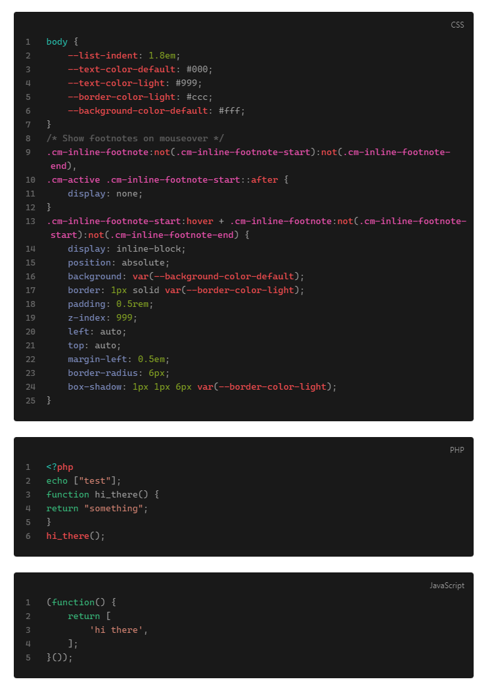
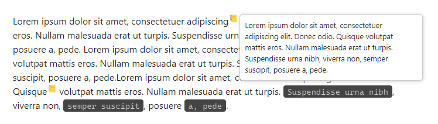
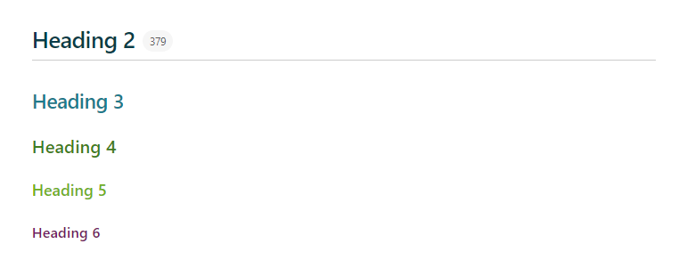
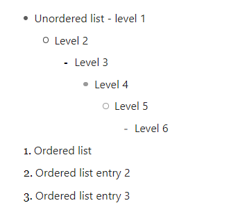
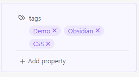
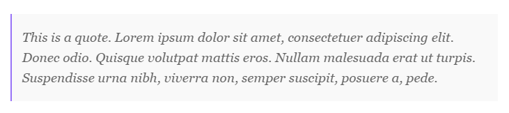
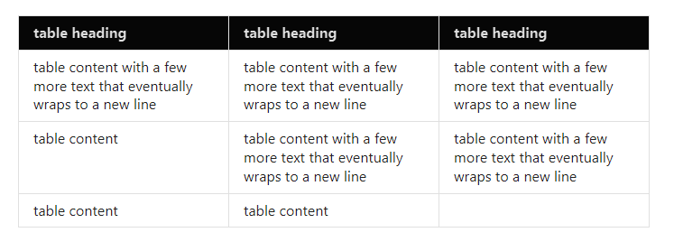
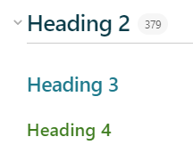
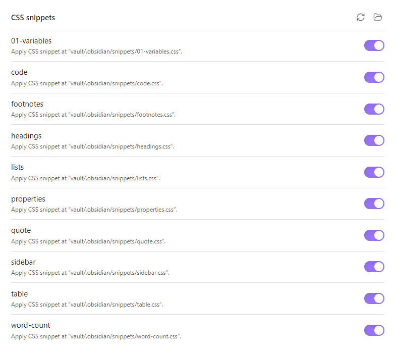
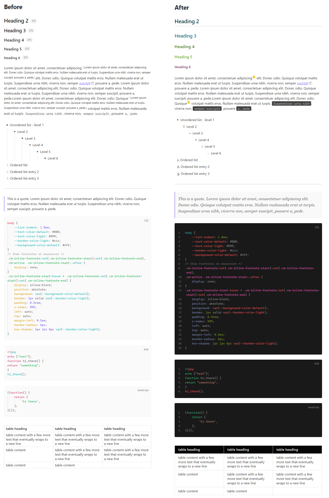

# CSS Snippets for Obsidian
Various CSS Snippets for Obsidian's "Edit" view (I never use the Reading view 😁), using the default theme in light mode. They are modular on purpose, so that they can be easily enabled or disabled individually.

01-variables.css

Sets the variables that  should be carried over across the various snippets. It is prefixed with `01-` to ensure that it will always load first.

code.css

* Changes to the CodeBlock layout. It uses `filter: invert()` so that it applies the reverse styling on dark mode. 
* Highlights the hovered line.
* Adds numbers to the side. 

footnotes.css

Converts the footnotes to tooltips which show their content on hover.

headings.css

Styles the various headings.

lists.css

Styles the lists (ordered and unordered).

properties.css

Styles the properties block.

quote.css

Styles the quote block.

sidebar.css

Hides the Attachments folder from the sidebar.

table.css

Styling changes to the tables from the [Advanced Table](https://github.com/tgrosinger/advanced-tables-obsidian) plugin.

word-count.css

A small modification for the [Better Word Count](https://github.com/lukeleppan/better-word-count) plugin, which only shows the counter on hover. 

---

