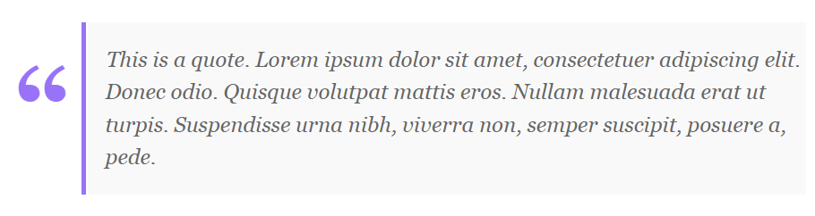

# obsidian-css-snippets
Various CSS Snippets for Obsidian's "Edit" view (I never use the Reading view 😁).

---

## code.css
* Changes to the CodeBlock layout. It uses `filter: invert()` so that it applies the reverse styling on dark mode. 
* Highlights the hovered line.
* Adds numbers to the side. 

## footnotes.css
* Converts the footnotes to tooltips which show their content on hover. 

 
## headings.css
* Styles the various headings.

## lists.css
* Styles the lists (ordered and unordered).

## properties.css
* Styles the properties block.

## quote.css
* Styles the quote block.

## sidebar.css
* Hides the Attachments folder from the sidebar.

## table.css
* Styling changes to the tables from the Advanced Table plugin.

## word-count.css
* A small modification for the Better Word Count plugin, which only shows the counter on hover. 

