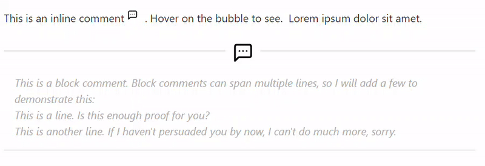

# CSS Snippets for Obsidian
Various CSS Snippets for Obsidian's "Edit" view (I never use the Reading view 😁), using the default theme in light mode. They are modular on purpose, so that they can be easily enabled or disabled individually.

<details>
<summary>01-variables.css</summary>

Sets the variables that  should be carried over across the various snippets. It is prefixed with `01-` to ensure that it will always load first.

</details>

<details>
<summary>bg-grid.css</summary>
If enabled, it will add a square grid background to all the notes including the `bg--grid` cssclass in their properties:


</details>

<details>
<summary>bg-lines.css</summary>
If enabled, it will add horizontal lines to all the notes including the `bg--lines` cssclass in their properties:


</details>

<details>
<summary>callout-spoiler.css</summary>

Styles a `spoiler` custom [callout](https://help.obsidian.md/Editing+and+formatting/Callouts), and reveals its contents after the box is both expanded and the user hovers over the content area.


Syntax:
```markdown
> [!spoiler]- Spoiler
> The butler did it!
```

</details>

<details>
<summary>code.css</summary>

* Changes to the CodeBlock layout. It uses `filter: invert()` so that it applies the reverse styling on dark mode. 
* Highlights the hovered line.
* Adds numbers to the side. 


</details>

<details>
<summary>comments.css</summary>

Converts [comments](https://help.obsidian.md/Editing+and+formatting/Basic+formatting+syntax#Comments) to tooltips which show their content on hover. It works for both inline and block comments. 



Syntax:
```markdown
You can use inline footnotes ^[This is an inline footnote.] and then continue your text.
```

</details>

<details>
<summary>footnotes.css</summary>

Converts [inline footnotes](https://help.obsidian.md/Editing+and+formatting/Basic+formatting+syntax#Footnotes) to tooltips which show their content on hover.


Syntax:
```markdown
You can use inline footnotes ^[This is an inline footnote.] and then continue your text.
```

</details>

<details>
<summary>headings.css</summary>

Styles the various headings.


</details>

<details>
<summary>lists.css</summary>

Styles the lists (ordered and unordered).


</details>

<details>
<summary>properties.css</summary>

Styles the properties block.


</details>

<details>
<summary>quote.css</summary>

Styles the quote block.


</details>

<details>
<summary>sidebar.css</summary>

Hides the Attachments folder from the sidebar.

</details>

<details>
<summary>table.css</summary>

Styling changes to the tables from the [Advanced Table](https://github.com/tgrosinger/advanced-tables-obsidian) plugin.


</details>

<details>
<summary>word-count.css</summary>

A small modification for the [Better Word Count](https://github.com/lukeleppan/better-word-count) plugin, which only shows the counter on hover. 


</details>

---


# My other Obsidian projects
* 👉 [Sentinel](https://github.com/gsarig/obsidian-sentinel): Update properties or run commands based on document visibility changes (e.g. every time a note opens or closes).
* 👉 [Varinote](https://github.com/gsarig/obsidian-varinote): Add variables in Templates and set their values during the Note creation. 